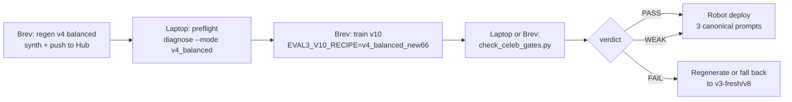

# Eval 3 — Identity-fix retrain runbook (v10, v4 balanced corpus)

This is the cluster + robot handoff for fixing the **celebrity-confusion bug** in the v9 ChArUco SmolVLA checkpoints. Follow it top-to-bottom: data gen on Brev/CUDA, cheap preflight on the laptop, training on Brev/CUDA, offline gate, robot deploy.

## TL;DR

The v9 charuco SmolVLA checkpoints (`eval3-vla-v9-smolvla-fresh-charuco-50k`, `eval3-vla-v9-smolvla-fresh-new66-charuco-50k`) grasp smoothly but ignore the celebrity name. Same-image prompt-swap L2 is ~6° (gate target ≥15°; v3-fresh clears ~17° on Swift pairs). Root cause documented in [outputs/eval3_celebrity_diagnosis/DIAGNOSIS_REPORT.md](../../outputs/eval3_celebrity_diagnosis/DIAGNOSIS_REPORT.md): every `dataset_v3_synth_<celeb>_<slot>_2` repo shares **bitwise-identical actions across celebs at the same slot** — BC can solve the task by ignoring language.

This runbook lands the four-fix v10 path: regenerate synth as **v4 balanced** (one dataset per celeb spanning all three slots; action target follows where that celeb is placed), retrain SmolVLA with the v10 recipe (capped synth + face-preserving augs + canonical-prompt task aug), gate the checkpoint offline, then deploy with the three canonical prompts.



## 1. Why this retrain exists

Three pieces of evidence make the bug unambiguous:

1. **Action duplication on disk.** [tools/eval3_diagnose_celeb_confusion.py](../../tools/eval3_diagnose_celeb_confusion.py) `--mode v3_slots` pulls one parquet per repo and shows `action(swift_left_2) == action(lecun_left_2) == action(obama_left_2)` bitwise for all three slots (artifact: [outputs/eval3_diag/celeb_confusion.json](../../outputs/eval3_diag/celeb_confusion.json), `taylor_swift_vs_yann_lecun.bitwise_equal: true` at every slot).
2. **Offline prompt collapse.** [tools/eval3_promptswap_quick.py](../../tools/eval3_promptswap_quick.py) on `eval3-vla-v9-smolvla-fresh-charuco-50k` gives `min_pair_mean: 5.89°` ([outputs/eval3_diag/promptswap_v9_charuco.json](../../outputs/eval3_diag/promptswap_v9_charuco.json)); v3-fresh gives `min_pair_mean: 4.94°` on the same gate (lecun-obama collapses there) but **Swift-vs-others** clears 17° — meaning v3 has *some* language conditioning that v9 lost.
3. **Robot behavior.** Hardware rollouts on v9 reach the same physical slot regardless of the prompt — matches the offline collapse.

Acceptance target for v10:

| Tier | Quick prompt-swap `min_pair_mean` (deg) | Action |
|---|---|---|
| FAIL | `< 5` | Don't deploy. Likely re-collapse; check preflight + recipe. |
| WEAK | `5 – 15` | Robot deploy is a gamble. Try canonical prompts; fall back to v3-fresh/v8 if it picks wrong. |
| PASS | `15 – 30` | v3-fresh-comparable. Ship. |
| STRICT PASS | `>= 30` | Aspirational; matches `eval3_synthetic_ood_test` primary gate. |

## 2. Generate v4 balanced data (Brev/CUDA box)

The v4 balanced corpus differs from v3 in three ways:

- **One dataset per celebrity**, not nine. Each contains 750 episodes spanning **all three placement slots** internally.
- **Action target follows the named celebrity.** Swift's dataset has episodes where the arm reaches *wherever Swift is placed* — not a fixed slot.
- **Pixel-identical face composites across the three v4 datasets.** [tools/eval3_synth_dataset_gen.py:TileCache](../../tools/eval3_synth_dataset_gen.py) now seeds blend noise per `(seed_base, slug, photo_idx)` and the balanced workers share `seed_base = hash(("v4","balanced","v2_shared"))`, so the *same `(slug, photo_idx)` tile is bitwise-identical across Swift/LeCun/Obama datasets*. That gives the trainer strict same-face-different-prompt counterfactuals across the three datasets (background still differs because action source depends on slot).

> If you already pushed a `dataset_v4_synth_*_balanced_1` to the Hub before this turn's `TileCache` change, those tiles are **not** shared and you must regenerate. The dataset names below assume a fresh push.

Command (run on Brev, 3 workers = one per celebrity, ~1.5 hr per worker):

```bash
EVAL3_SYNTH_BALANCED=1 \
EVAL3_SYNTH_OUTPUT_VERSION=v4 \
EVAL3_SYNTH_WORKERS=3 \
EVAL3_SYNTH_PUSH_TO_HUB=1 \
  ./scripts/run_eval3_synth_dataset_gen.sh
```

This writes and pushes:

- `RobotLearningVLA/dataset_v4_synth_taylor_swift_balanced_1`
- `RobotLearningVLA/dataset_v4_synth_yann_lecun_balanced_1`
- `RobotLearningVLA/dataset_v4_synth_barack_obama_balanced_1`

Each is tagged `v3.0` automatically (`_push_to_hub` in [tools/eval3_synth_dataset_gen.py](../../tools/eval3_synth_dataset_gen.py)).

Smoke test before the full sweep (one dataset, 6 episodes, ~5 min):

```bash
EVAL3_SYNTH_BALANCED=1 EVAL3_SYNTH_OUTPUT_VERSION=v4 \
EVAL3_SYNTH_CELEBS=taylor_swift EVAL3_SYNTH_N_CONFIGS=6 EVAL3_SYNTH_WORKERS=1 \
  ./scripts/run_eval3_synth_dataset_gen.sh
```

Inspect with `python tools/inspect_lerobot_dataset.py --repo-id datasets/dataset_v4_synth_taylor_swift_balanced_1` and confirm episodes 0/1/2 have visibly different arm trajectories (one reaches left, one middle, one right).

## 3. Preflight on the laptop (cheap, no GPU)

Before launching the 50k-step trainer on Brev, validate the v4 corpus from the macOS box:

```bash
.venv/bin/python tools/eval3_diagnose_celeb_confusion.py \
    --mode v4_balanced \
    --out outputs/eval3_diag/v4_balanced_preflight.json
```

This pulls `meta/episodes` + `data/chunk-000` parquet per repo (~6 MB each, ~30 s total), classifies each episode's first-frame `shoulder_lift` into `left | middle | right` using known v3 source signatures, and asserts:

- Every v4 repo covers **all three slots** (PASS criterion).
- The slot distribution is within ±20% of uniform (PASS criterion; WEAK if skewed but all 3 present).

Exit code 0 = PASS, 1 = WEAK, 2 = FAIL. If FAIL, regenerate before training — the v4 invariant is broken and the trainer would re-learn the v9 shortcut.

## 4. Train v10 (Brev/CUDA)

```bash
EVAL3_V10_RECIPE=v4_balanced_new66 EVAL3_POLICY_DEVICE=cuda \
  ./scripts/run_eval3_smolvla_v10_train.sh
```

What this sets, by default:

| Env var | v10 default | Why |
|---|---|---|
| `EVAL3_DATASET_REPO` | `RobotLearningVLA/dataset_v2_taylor_swift_left_1_v6_truncated` | new66 real data anchor |
| `EVAL3_EXTRA_REPOS` | new66 (8 v2 truncated repos) + 3 v4 balanced repos | mixed real + synth |
| `EVAL3_SYNTH_EPISODE_LIMIT` | `75` | cap each v4 repo to ~37.5k frames → real >= ~25% of mix |
| `EVAL3_MAX_FRAMES_PER_EP` | `600` | 20s @ 30 fps, matches Eval 3 wall clock |
| `EVAL3_TASK_AUG` | `1` | task-string augmentation on |
| `EVAL3_TASK_AUG_CANONICAL_P` | `1.0` | **100% canonical wording** (no "the" variant); matches deploy |
| `EVAL3_BG_REPLACE`, `EVAL3_PRINT_SHUFFLE` | `0` | mask-based augs OFF; v4 synth would corrupt with v2 print masks ([eval3_concat_patch.py](../../scripts/eval3_concat_patch.py) skips them on synth anyway, this just keeps real new66 clean too) |
| `EVAL3_TFS_JSON` | face-preserving 10-transform JSON | softens RandomErasing, RandomPerspective, GaussianBlur, ColorJitter ranges to preserve facial features (see launcher header for per-transform deltas) |
| `EVAL3_TRAIN_STEPS` | `50000` | matches v3/v8/v9 |
| `EVAL3_BATCH` | `8` | matches v9 charuco |
| `EVAL3_SAVE_FREQ` | `10000` | 5 checkpoints + final |

Alternative recipe:

```bash
EVAL3_V10_RECIPE=v4_balanced_only EVAL3_POLICY_DEVICE=cuda \
  ./scripts/run_eval3_smolvla_v10_train.sh
```

This trains on v4 synth only (no real new66). Use it as an ablation if `v4_balanced_new66` fails the gate — it isolates whether the issue is the synth corpus or the real/synth mix.

Output:

- Local: `outputs/train/eval3-vla-v10-smolvla-fresh-v4balanced-new66-50k/checkpoints/050000/pretrained_model`
- Pushed to: `RobotLearningVLA/eval3-vla-v10-smolvla-fresh-v4balanced-new66-50k` (set `EVAL3_JOB_NAME` to override)

## 5. Gate + deploy

### 5a. Offline gate (laptop or Brev)

```bash
.venv/bin/python tools/eval3_check_celeb_gates.py \
    --policy_path RobotLearningVLA/eval3-vla-v10-smolvla-fresh-v4balanced-new66-50k \
    --policy_device mps \
    --label v10_balanced_new66
```

Default thresholds (v3-fresh-comparable): `--prompt_swap_min 15`, `--ood_min 15`, `--ood_shoulder_lift_min 30`. Use `--prompt_swap_min 30 --ood_min 30` for the strict aspirational gate.

Artifacts:

- `outputs/eval3_diag/promptswap_quick_v10_balanced_new66.json`
- `outputs/eval3_diag/synthetic_ood_v10_balanced_new66/synthetic_ood_results.json`

Decision tree:

- **PASS / STRICT PASS** → proceed to deploy (5b).
- **WEAK** → robot test is OK to try; observe the three prompts, fall back to v3-fresh/v8 if any one consistently picks the wrong celebrity.
- **FAIL** with `min pair < 5°` → re-collapsed; check preflight passed, then try `v4_balanced_only` recipe; if that also FAILs, regenerate v4 with broader photo pool (`EVAL3_SYNTH_CELEB_JSON='datasets/in-distribution-eval-3.json,datasets/out-distribution-eval-3.json'`).

### 5b. Robot deploy (the rig with the SO-101)

Use the three **canonical** prompts only. No "the", no `--target_slot`:

- `Place the coke on Taylor Swift`
- `Place the coke on Yann LeCun`
- `Place the coke on Barack Obama`

Pre-flight any deploy command line with the existing linter:

```bash
python tools/eval3_check_deploy_command.py \
    --policy-pretrained-path RobotLearningVLA/eval3-vla-v10-smolvla-fresh-v4balanced-new66-50k \
    --rename-map '{"observation.images.front":"observation.images.camera1"}' \
    --task "Place the coke on Taylor Swift"
```

Want `PASS (cameras=OK, task=OK)` on the final line. Then run the deploy directly via [scripts/eval3_vla_deploy.py](../../scripts/eval3_vla_deploy.py) (the v10 alias in `run_eval3_deploy_battery.sh` is deferred — see appendix). Use the v9 charuco alias's flag block as a template since it's the closest match:

```bash
python scripts/eval3_vla_deploy.py \
    --robot.type=so101_follower \
    --robot.port="$FOLLOWER_TTY" \
    --robot.id=my_awesome_follower_arm \
    --robot.cameras="{front: {type: opencv, index_or_path: ${CAM_IDX:-0}, width: 640, height: 480, fps: 30}}" \
    --rename_map='{"observation.images.front":"observation.images.camera1"}' \
    --policy.device=mps \
    --policy.empty_cameras=2 \
    --policy.num_steps=20 \
    --policy.n_action_steps=25 \
    --interpolation_multiplier=2 \
    --action_smoothing_alpha=0.25 \
    --max_action_delta_deg=6 \
    --gripper_open_bias_deg=5 \
    --gripper_open_bias_threshold_deg=20 \
    --episode_time_s=20 \
    --fps=30 \
    --display_data=true \
    --dataset_repo_id=RobotLearningVLA/taylor_swift_1 \
    --policy.path=RobotLearningVLA/eval3-vla-v10-smolvla-fresh-v4balanced-new66-50k \
    --task='Place the coke on Taylor Swift'
```

Sanity-check the JSONL output under `outputs/eval3_rollouts/`: final-second `wrist_roll` should differ between Swift and LeCun/Obama prompts (Swift around `-80°`, LeCun/Obama around `+85°` if the v3-fresh signature carries; if v10 has a different wrist_roll signature that's still fine as long as the three are visibly distinct).

## Appendix — What this runbook does NOT cover, and why

- **`v4_balanced_new66_strict` recipe.** Adds v1 real data to the mix + turns `EVAL3_BG_REPLACE`/`EVAL3_PRINT_SHUFFLE` back on for real data only. Worth landing only if `v4_balanced_new66` still WEAK/FAILs the gate. The strict-vs-default delta is small (canonical_p is already 1.0 in the default v10 launcher), so this is a one-line PR away if you need it.
- **v10 aliases in [scripts/run_eval3_deploy_battery.sh](../../scripts/run_eval3_deploy_battery.sh).** Deferred until the v10 Hub name is final. The deploy command above is the same minus the alias. Once you've pushed the checkpoint and confirmed the name, follow the pattern of the `v9_charuco` block — copy it, change `POLICY_PATH`, keep the `NO_BIASES` block off (v10 expects the friend-recipe biases like v8 does, not the raw-policy biases of v9).
- **Synth-specific mask extraction.** [scripts/eval3_concat_patch.py](../../scripts/eval3_concat_patch.py) already guards against mismatched v2 print masks on synth repos (Fix D from the original plan). To re-enable mask-based augs on synth, you'd need a per-slot mask extracted from the ChArUco-composited frames; that's a downstream item that only matters if v10 underperforms.
- **Two-stage slot-selector deploy.** Already available behind `EVAL3_SLOT_TASK_AUG` and described in [docs/eval3/abcd_model_eval.md](abcd_model_eval.md). Escape hatch only.

## Cross-references

- Root-cause diagnosis: [outputs/eval3_celebrity_diagnosis/DIAGNOSIS_REPORT.md](../../outputs/eval3_celebrity_diagnosis/DIAGNOSIS_REPORT.md)
- v10 training recipe: [scripts/run_eval3_smolvla_v10_train.sh](../../scripts/run_eval3_smolvla_v10_train.sh)
- v4 generator: [tools/eval3_synth_dataset_gen.py](../../tools/eval3_synth_dataset_gen.py) + [scripts/run_eval3_synth_dataset_gen.sh](../../scripts/run_eval3_synth_dataset_gen.sh)
- Preflight: [tools/eval3_diagnose_celeb_confusion.py](../../tools/eval3_diagnose_celeb_confusion.py) (`--mode v4_balanced`)
- Offline gate: [tools/eval3_check_celeb_gates.py](../../tools/eval3_check_celeb_gates.py)
- Existing deploy handoff (v3-fresh): [docs/eval3/friend_deploy_handoff.md](friend_deploy_handoff.md)
